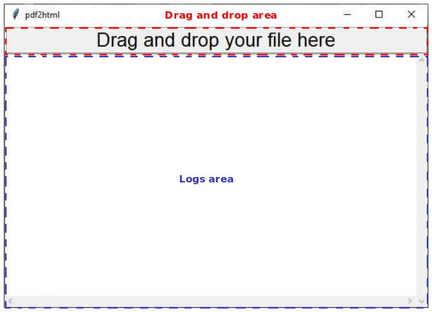

# pdf2html
This simply script retrieves the file path of the pdf you want to convert by drag & drop tkinter gui.
Then use poppler to turn each page of the pdf into a png image.
Finally it adds the images to an html file using base64 encoding and deletes the previously generated images. 

# how to install D&D dependencies: 
guide: https://stackoverflow.com/a/46856247  
library: https://github.com/pmgagne/tkinterdnd2, rename the folder to TkinterDnD2 when you copy it into site-packages 
tk extension: https://github.com/petasis/tkdnd v2.9.2 
    
# pip dependencies: 
pdf2image, PyPDF2 
    
# make sure you have installed poppler 
linux ->  `apt-get install -y poppler-utils` 
winzoz -> https://stackoverflow.com/a/53960829 

  

 

